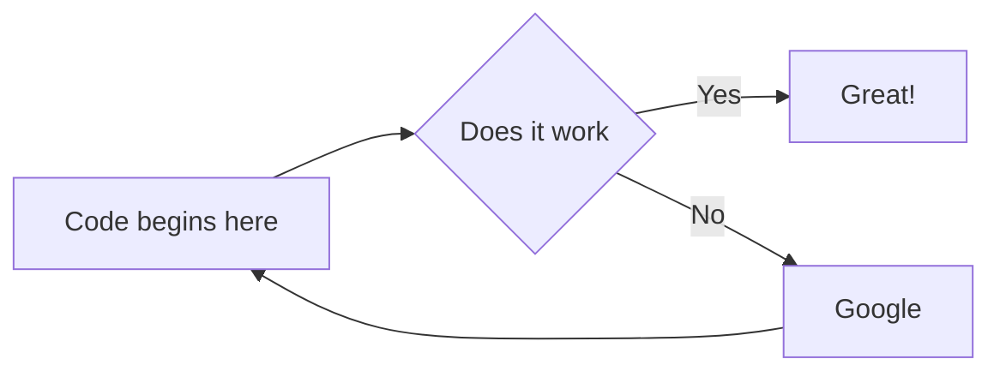

# HEAPS

| A   | B   | C   |
|-----|-----|-----|
| E   | F   | G   |

Mermaid Diagram

## Heaps
This abstract data structure allows us to perform
both insertions and removals in logarithmic time.

| Null | 5   | -1  | 2   | 8   | 15  | 3   | 6   | 12  | 1   | 7   | 4   | 7   | Null | Null | Null |
|------|-----|-----|-----|-----|-----|-----|-----|-----|-----|-----|-----|-----|------|------|------|

In Priority Queue, there is an assumption that the client's code does not change the keys. 
For example, let A be the array above.
A[6] = 21 might invalidate the heap-order invariant.

In order to refer to items already on the Priority Queue, we associate a unique integer index with
each item.

Keys to Thinking like a Programmer.
1. Thinking Methodically.
2. Decomposition of Problems.
3. Thinking Algorithmically.

Proof by Induction.
S(n) = n(n + 1) / 2

SETS
There are essentially _**two ways**_ to specify a particular set:
1. One way, if possible, is to list its members separated by commas and contained in braces {};
2. A second way is to state those properties which characterized the elements in the set.

A = {1, 3, 5, 7, 9}--------A consists of the numbers 1, 3, 5, 7, 9.
B = {x | x is an even integer, x > 0}-----B is the set of x such that x is an even integer and x
is greater than 0, denotes the set B whose elements are the positive integers.
The vertical line | means "such that" and the comma as "and". 

**Example**
The set A above can be written as A = {x | x is an odd positive integer, x > 10}
If we assume that everyone know what we mean, 
B = {2, 4, 6, ...}
Observe that 8 ∈ B but 3 is not a member of B.

Let E = {x | x2 - 3x + 2 = 0 }
F = {2, 1}
G = {1, 2, 2, 1}
Then E = F = G.

We emphasize that a set does not depend on the way in which its elements are displayed. 
A set remains the same if its elements are repeated or rearranged.

SUBSETS
Suppose every element in a set A is also an element of a set B, that is, suppose 
a ∈ A implies a ∈ B. Then A is called the subset of B. We also say that A is contained in B or that
B contains A. This relationship is written as
A ⊆ B or B ⊇ A 

**A = B if and only if A ⊆ B and B ⊆ A**

DIRECT ACCESS ARRAY

